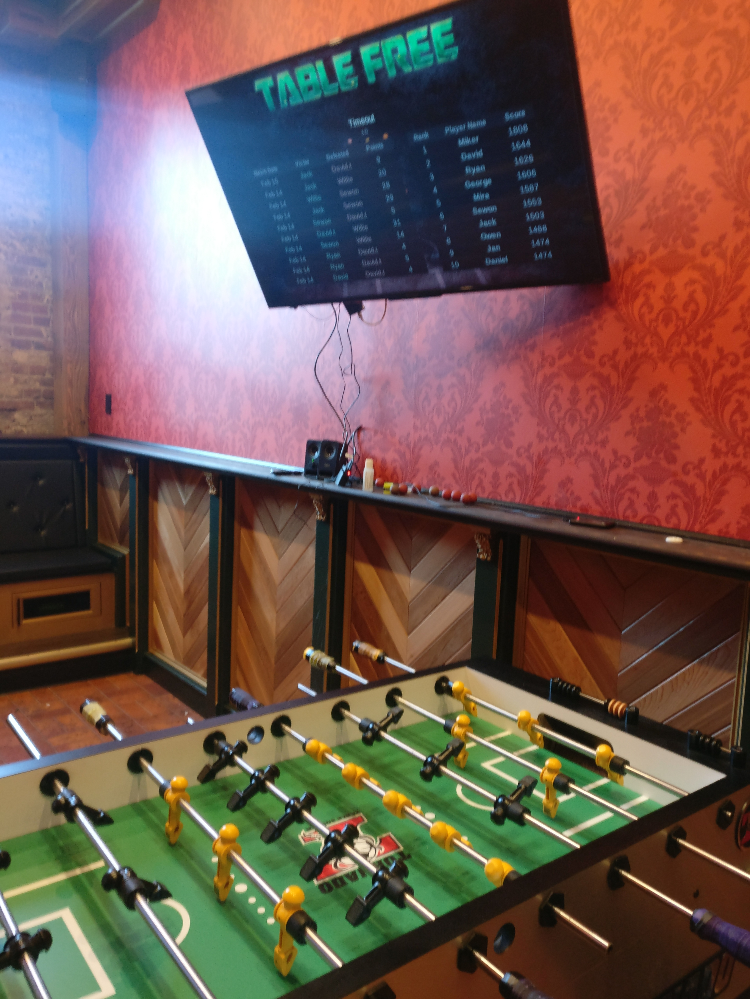
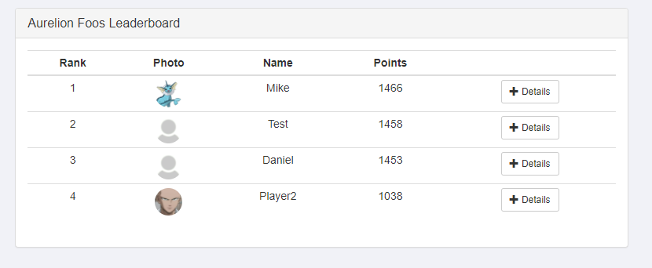
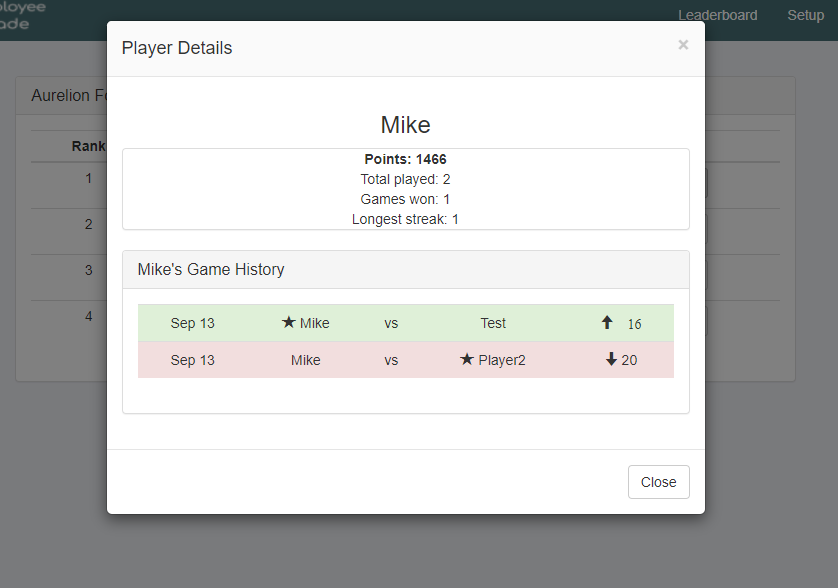

# foosbot
This is the codebase for a foosball leaderboard system I created for use at local businesses. Due to covid, this service has not seen growth so I am open sourcing the code. This can be used for any 2 player game.

Every player gets a simple keychain fob. Two players tap their fobs at the table to start a game. The winner taps once more at the end. The game is recorded and a chess style ELO is tracked for each player for a statistically accurate leaderboard based on player skill.

### Features:
   - A display near the table, which shows the current top players, recent games, and current game in progress.
   - Slack integration, which shows if the table is currently in use, and reports the wins/losses, along with win streaks.
   - Text to Speech audio at table. Declares who is playing and announces the winner along with if they are dominating.
   - Web based Leaderboard with match history. Can be integrated into an iframe to display on internal website.
   - Admin portal to add/remove players and assign fobs
   
### Hardware:
   - Raspberry pi and fob reader with power and internet access (required)
   - Key fobs (required)
   - Monitor dislay using HDMI (optional)
   - Speakers (optional)

**If you would like to make use of the service, feel free to email me at aurelion314@gmail.com**

### Table Kiosk/Display

### Leadboard

### Match History

